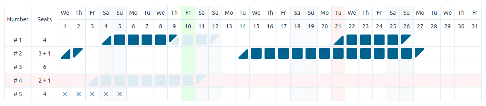

# Reservation Grid
A modular grid that allows managing reservations for a hotel



## Installation
<a name="installation"></a>

```
npm install @daminort/reservation-grid
```

## Usage
<a name="usage"></a>

```javascript
import React, { FC, useCallback } from 'react';
import { ReservationGrid, DayType, Row } from '@daminort/reservation-grid';

const App: FC = () => {

  const onClickTitle = useCallback((value: string) => {
    console.log(`Selected row with # ${value}`);
  }, []);

  const onClickCell = useCallback(({ value: string, date: string, dayType: DayType }) => {
    console.log('Selected cell:', { value, date, dayType });
  }, []);

  const data: Row[] = [
    value: '# 1',
    info: '4',
    periods: [
      { start: '2021-11-04', end: '2021-11-09', status: 'confirmed' },
      { start: '2021-11-09', end: '2021-11-12', status: 'awaiting' },
    ],
  ];

  return (
    <ReservationGrid
      highlightToday
      showInfo
      start="2021-11-01"
      end="2021-11-30"
      title="Number"
      info="Seats"
      locale="en"
      data={data}
      onClickTitle={onClickTitle}
      onClickCell={onClickCell}
    />
  );
};

```

## Props
<a name="props"></a>

|Name|Type|Required|Default|Example|
|----|----|--------|-------|-------|
|start|string|*|-|'2021-11-01'
|end|string|*|-|'2021-11-30'
|highlightToday|boolean|-|true|
|showInfo|boolean|-|true|
|selectedColumns|string[]|-|[ ]|['2021-11-01', '2021-11-02']
|selectedRows|string[]|-|[ ]|['# 1']
|theme|Theme|-|default theme|
|locale|LocaleKey|-|en|
|title|string|-|'Number'|
|info|string|-|empty string|
|data|Row[]|*|-|see example above
|onClickTitle|Function|-|-|(value) => console.log(value)
|onClickCell|Function|-|-|({ value, date, dayType }) => console.log({ value, date, dayType })

#### Data
<a name="data"></a>

The data is an array of the Rows:
```javascript
type DateStatus = 'awaiting' | 'confirmed' | 'inaccessible';

interface ReservedPeriod {
  start: string;
  end: string;
  status: DateStatus;
}

interface Row {
  value: string;
  info: string;
  periods: ReservedPeriod[];
}

```

Example:
```javascript
const data: Row[] = [
  {
    value: 'Number 1',
    info: '4 seats',
    periods: [
      { start: '2021-11-04', end: '2021-11-09', status: 'confirmed' },
      { start: '2021-11-09', end: '2021-11-12', status: 'awaiting' },
      { start: '2021-11-21', end: '2021-11-26', status: 'confirmed' },
    ],
  },
  {
    value: 'Number 2',
    info: '3 seats',
    periods: [
      { start: '2021-11-01', end: '2021-11-02', status: 'confirmed' },
      { start: '2021-11-14', end: '2021-11-27', status: 'confirmed' },
    ],
  },
];
```

#### Locale
<a name="locale"></a>

Locale can be either `en`, `ua` or `ru`:
```javascript
type LocaleKey = 'en' | 'ua' | 'ru';
```

#### Theme
<a name="theme"></a>

You can change appearance of the Reservation Grid. And you don't need to pass the entire theme: just pass keys you want to change.

Default theme:
```javascript
const THEME: Theme = {
  'font.face': 'sans-serif',
  'font.size': '14px',
  'color.text': '#30424F',
  'color.background': '#FFFFFF',
  'color.border': '#DDEBF3',
  'color.free': 'transparent',
  'color.awaiting': '#DDEBF3',
  'color.confirmed': '#006490',
  'color.inaccessible': '#759AB5',
  'color.today': '#E4FFE6',
  'color.selected': '#FFF2F2',
  'color.weekend': '#F8FAFB',
  'width.title': '50%',
  'width.info': '50%',
};
```

## Local development
<a name="local"></a>

In order to have an ability test package locally without need to publish it to the NPM follow the next steps:

1. Build package
```
npm run build
```

2. Go to the package in which you are planning to use Reservation Grid and link it there (in our case - `example` folder)
```
cd example
npm run relink
```
This command will remove folder `node_modules/@daminort` and create new actual linked folder.

3. Go back to the package folder and link React package. It is needed to avoid errors regarding different React instances:
```
cd ..
npm run relink
```

You should go through points 1-2 every time you update package.

## Publishing
<a name="publishing"></a>

```
npm login
npm publish --access public
```

## License
<a name="license"></a>

[MIT](/LICENSE) © [Daminort](https://github.com/daminort)
